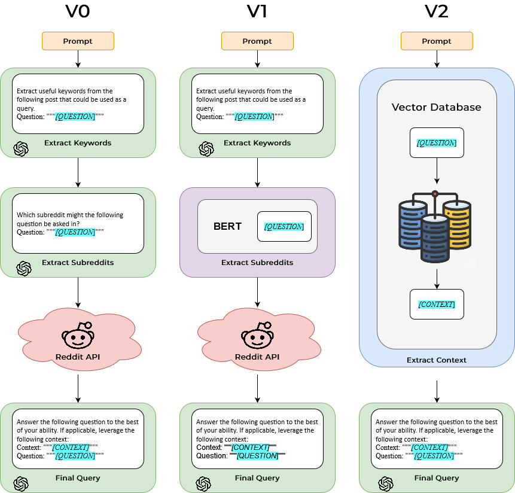
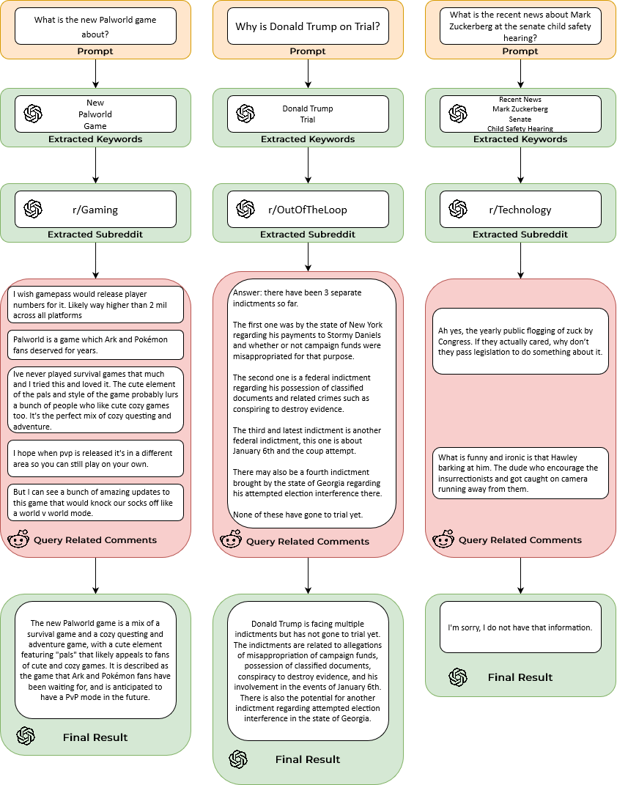

# Reddit RAG
## Task Overview
We are investigating how social media data can be leveraged to improve the responses of large language models through retrieval augmented generation (RAG). For these experiments, we leverage Reddit data to provide models with context that can inform responses.

## Architecture
We propose three different variations of our RAG model.
- V0 (Zero-shot) - This approach fully leverages ChatGPT, without any finetuning. We simply ask ChatGPT to select useful query parameters and a relevant subreddit before querying Reddit. After querying the Reddit to find a relevant post, we extract the top three comments and provide them to ChatGPT as context.
- V1 (BERT-Optimized) - This approach leverages BERT and a custom dataset created by working backwards from existing reddit posts. This will constrain our search to specific subreddits but we can filter out non-informational subreddits.
- V2 (Full RAG) Using PushShift dumps, we can create a vector database of posts and comments that may be useful for our application. We will manually filter out irrelevant subreddits. Additionally, we will augment the dumps with more current reddit posts obtained through crawling.

## Initial Results
#### V0 (Zero-shot)
Below we have initial results of our zero-shot model. The best result was in asking the model about the new `Palworld` game. If the same query is asked to ChatGPT without Reddit RAG, ChatGPT has no information about the game (as it only recently was released). However, in other cases tested, the model did poorly.

We observed three bottlenecks in our V0 approach. First, the keyword extractor seemed unhelpful. Low signal words like "Recent News" or "New" would muddy the query parameters and lead to lower quality results from the Reddit API. Second, it was typical that the relevant post identified was an incorrect but related event. This was particularly apparent when querying about recent news since our Reddit query looks at all posts from any time. There is potential leverage the post recency parameter based on the initial prompt. Finally, the quality of the comments returned were hit or miss. Sometimes they were informational and would provide relevant context but others were opinionated or simply irrelevant jokes. Filtering the specific subreddits we leverage or even leveraging text from links could be a worthwhile strategy to improving performance.

